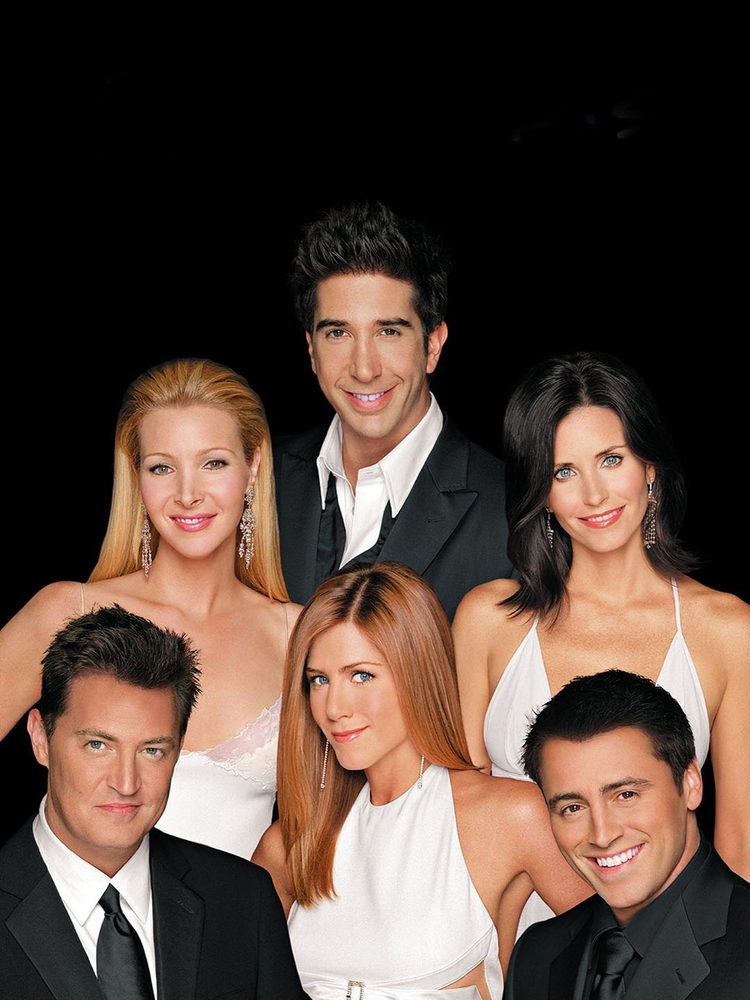

---

<h2>

Background

</h2>

The project will discuss the relations between the collected data from the series "Friends" to the IMDb rating and the character's emotions along the series. 
Our two Research Questions our models come to solve are: 
1. Who is the character brings the most rating to the series? 
2. Have any differences in the proportions of emotional expression between females to males? 

<h3>About friends</h3>

Friends is an American television sitcom created by David Crane and Marta Kauffman, which aired on NBC from September 22, 1994, to May 6, 2004, lasting ten seasons. 
 
With an ensemble cast consisting of Jennifer Aniston, Courteney Cox, Lisa Kudrow, Matt LeBlanc, Matthew Perry, and David Schwimmer, the show revolves around six friends in their 20s and 30s who live in Manhattan, New York City. 
 
Bright/Kauffman/Crane Productions produced the series associated with Warner Bros Television. The original executive producers were Kevin S. Bright, Kauffman, and Crane. 
 Friends received acclaim throughout its run, becoming one of the most popular television shows. The series was nominated for 62 Primetime Emmy Awards. The show ranked no. 21 on TV Guide's 50 Greatest TV Shows of All Time and no. 7 on Empire magazine's The 50 Greatest TV Shows.

